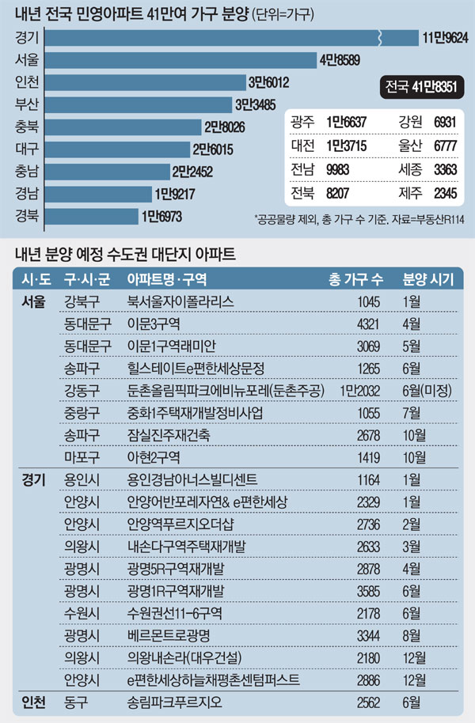

# 수익 사업

## 지역 분양 사업

트윈하우스에서 분양이 가능한 단지가 준비되면 지역 DAO가 사업 우선권을 가져갑니다. 지역 DAO의 금액이 사업비용을 감당하지 못하거나 사업자체를 거부하면 분양사업 DAO가 생성됩니다. 세금을 통해서만 DAO 자금의 확보가 가능합니다. 지역내 NFT분양자를 늘려서 세력을 키울 수 있습니다. DAO는 사업의 이익을 공유받습니다.


지약 분양 사업은 영구적입니다. 2021년 분양된 주택은 서울에서 11만 9,624세대입니다. 전국적으로 매년 끊임없이 사업이 이루어집니다. 지역DAO는 영속적으로 해당 지역의 분양사업이익을 가져갑니다.


## 지역기반 시뮬레이션 사업

지역기반 시뮬레이션 사업이 생기면 해당 이익을 배분 받습니다. 예를들어 어떤 구역의 상권 매출 의뢰가 왔을 때 트윈하우스의 데이터를 사용한다면 그에 대한 보상을 받습니다.
