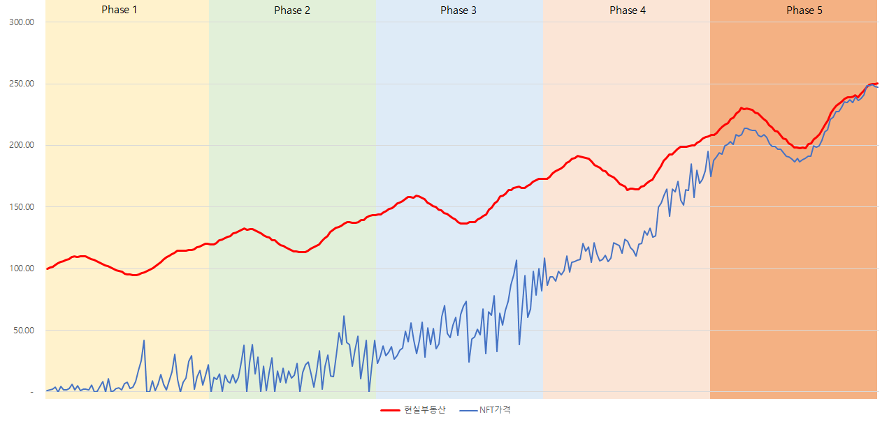

# 플랫폼 로드맵

> NFT가 현실 부동산의 가격 따라잡기

메타버스에 Phase를 나누어 접근할 예정이고 각 Phase당 분류는 다음과 같습니다.

#### Phase 1 : **초기 NFT 시장 - 2022-4Q**

현실 부동산에 비해 현저하게 낮은 가격에 거래되며 NFT가격의 변동성이 매우 높음

#### Phase 2 : **사용자 증가 시장 (레버리지 거래 시장) - 2023-4Q**

메타버스 서비스 시장 참여자가 증가하면서 NFT가격이 현실 부동산 시세에 조금 더 접근

은행의 대출 서비스 확대를 통해 레버리지 거래로 거래 회전율 상승

#### Phase 3 : **유동성 공급 시장 - TBD**

ETF, 펀드, 신탁 등 기관 투자가 가능한 다양한 투자 루트를 개발하여

시장 내 매수(Long) 투자자와 투자 규모를 높여 TW의 가치 상승으로 인한 NFT 가치 상승

#### Phase 4 : **헤지(Hedge)거래 시장 (변동성 투자) - TBD**

Long-Short 펀드, 프로그램매매 (가격 격차가 발생한 시장의 변동성 투자) 등 도입

NFT 거래 규모는 늘어나고 동시에 변동성 투자자의 등장으로 변동성이 줄어드는 시장

#### Phase 5 : **파생 상품 출현 - TBD**

현실 부동산 시장과 NFT 거래 시장 사이의 가격 및 변동성 차이에 투자하는 파생 상품

현실 부동산과 유사한 규모 및 변동성을 보이는 NFT 가격대에 도달

부동산 공매도, 선물/옵션 거래, 포워드 거래, els, dls 등의 특수한 계약 시장으로 확장
