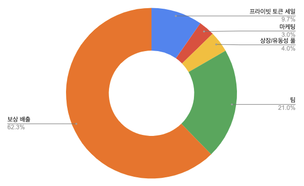

# 토큰배분

| 구분         |    비율 | 언락비율 | 배정수량        |
| ---------- | ----: | ---- | ----------- |
| 프라이빗 토큰 세일 |  9.7% | 100% | 40,012,500  |
| 마케팅        |    3% | 0%   | 12,375,000  |
| 상장/유동성 풀   |    4% | 0%   | 16,500,000  |
| 팀          |   21% | 100% | 86,625,000  |
| 보상 배출      | 62.3% | 0%   | 256,987,500 |

&#x20;Klayswap같은 유동성풀도 활용이 가능하도록 준비하고 있습니다.

팀물량은 기본 2년 락업에 상장이후부터 매달 5%씩 락업이 해제됩니다. 모든 락업해제 일정은 시장 유동성을 감안하여 개별 락업 해제 시기를 사전 공지할 예정입니다.
