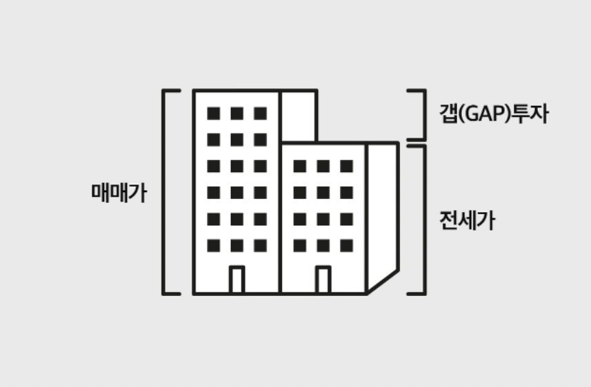

# NFT(E-주택)와 거래

## NFT의 활용

NFT는 블록체인 기반에서 소유를 증명할 수 있는 기술입니다. 우리는 현실 부동산과 동일한 디지털트윈을 만들어 NFT를 발행합니다.&#x20;

개인이 소유한 ‘E-주택(NFT) 가격’은 시장에 의해 결정됩니다. 형성되는 E-주택(NFT)의 가치가 현실 부동산의 흐름과 비슷하게 만든다면 우리는 새로운 거래 시장을 만들 수 있습니다.

## NFT 소유가치

### 전월세 계약 (NFT 스테이킹보상)&#x20;

&#x20;`E-주택(NFT)의 주인이 전월세 계약으로 얻는 보상은 트윈하우스 경제에서 주요 수입원입니다. 전월세 계약은 빅밸류 매매 시세를 바탕으로 시스템과 가상의 전월세 계약을 선택할 수 있습니다. E-주택 소유로 얻는 수익이고 영원히 얻을 수 있습니다. 중간에 소유권이 바뀌게 된다면 초단위로 나누어서 월세를 지급합니다.`

### 레어도

`현실부동산에서는 층에 따라 계약이 조금씩 차이가 납니다. 좋은 층은 조금 더 비싼 가격에 거래됩니다. 트윈하우스에서도 좋은 층일수록 좋은 수익률을 기대할 수 있습니다. 좋은층은 좀 더 높은 가격의 전월세 계약이 가능합니다.`

### 담보대출

`트윈하우스에서 은행은 E-주택(NFT) 담보 대출을 실행하거나 예금 이자를 지급합니다. 사용자들은 갭투자를 통해(레버리지 활용) 더욱더 높은 수익률에 도전할 수 있습니다. 투자 금액대비 높은 수익률은 당신의 능력에 달려있습니다.`

모든 투자가 그렇듯 투자 능력으로 투입대비 훨씬 높은 수익을 올릴 수 있습니다. 소유자의 수입은 NFT가격 상승, 전월세 계약, 실거래으로 인한 보너스입니다. 투자의 고수는 블록체인상에 공개가 됩니다.

### 현실 부동산 실거래 보너스

`실제 거래가 되는 주택을 소유하고 있으면 보너스를 받습니다. 거래량이 많은 주택을 소유하면 그만큼 많은 보너스를 얻게 됩니다. 현재 가격이 높거나 거래량이 많고 빠르게 오를 것 같은 주택의 소유가 유리합니다. 첫 분양은 거래로 보지 않습니다. 시세에서 거래 회전률을 곱해서 TW를 지급합니다.`

$$
타입 시세 * (같은 평형의 실거래수 / 전체세대수 * 100)
$$

## 분양과 멸실

현실에서는 다양한 이유로 주택이 나타나고 사라집니다.&#x20;

트윈하우스 서비스에서도 주택이 만들어지고 없어지는 과정을 그대로 구현합니다. 주택이 기능을 하지 못하면 월세 지급이 중단됩니다. 예를 들어 재건축으로 공사중인 단지는 공사 기간동안 전월세 계약을 하지 못합니다. 다만 재건축 이후 신축 단지에 조합원 자격으로 입주가 가능합니다.
